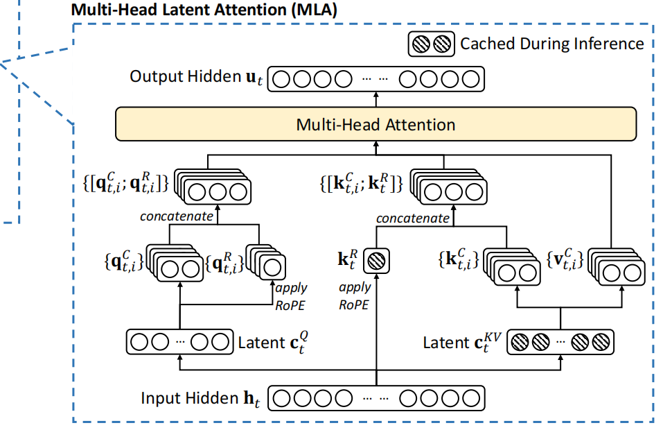
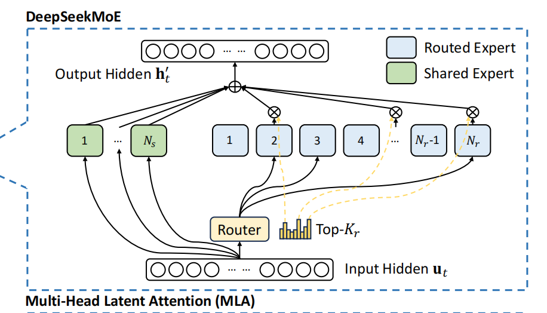
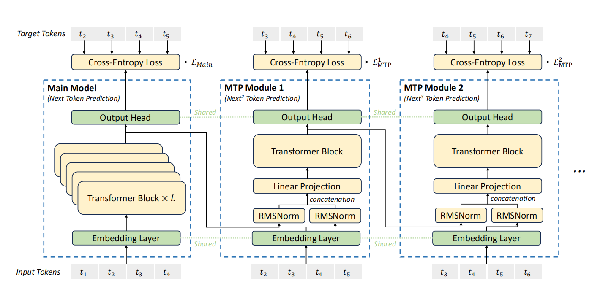
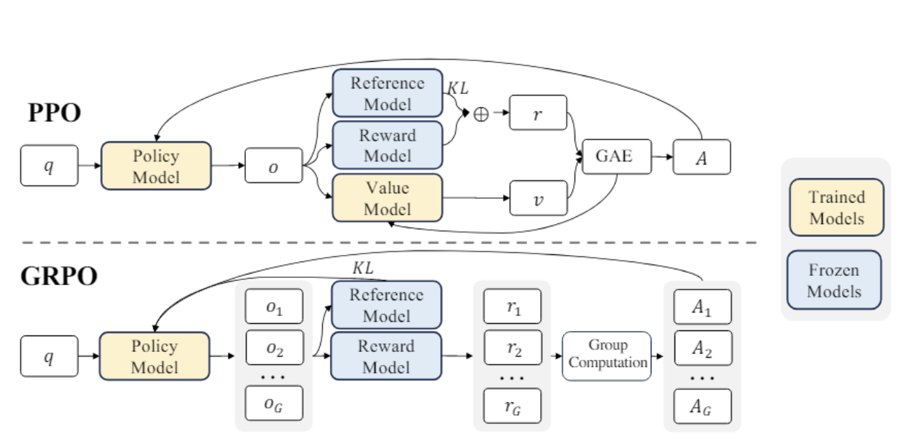

# deepseek_learning - ongoing
一个快速学习deepseek v3模型以及r1强化学习的仓库，侧重快速理解技术报告模型设计细节

# 一. v3
技术报告与代码来自[DeepSeek-V3](https://github.com/deepseek-ai/DeepSeek-V3)

学习讲解资料来自[EZ.Encoder](https://www.youtube.com/@ez.encoder.academy)

## 代码说明
deepseekV3开源的推理代码兼容分布式多卡推理，将embedding, MLA, MOE模块中的线性层平分到所有的卡中，使得小显存卡也能组合起来运行。在阅读代码时需要注意`// word_size`, `dist.all_reduce()`等分布式推理的map-reduce的操作。

可以运行v3/model.py配置进行代码阅读，建议先跳过linear函数中量化与反量化操作

## 模型结构
### MLA 多头低秩注意力
*背景：*
传统模型在推理时使用kv缓存进行加速，当文本越长需要的显存消耗越大（线性），MLA通过优化kv缓存机制，降低推理需要的显存消耗

传统kv缓存生成方式：预测得到下一个token，将其追加到历史输入进行前向传播，对该token生成k-v键值对，如`k = h * Wk`，追加到历史token的k-v缓存矩阵后进行前向计算。下一次计算计算时，不需要再计算获得该token的k-v键值对。牺牲了存储空间节省了计算量

<div align="center">
  
  <p style="font-size: 10px; color: gray;">MLA</p>
</div>

**MLA优化原理**：存储kv变成存储一个更低维的中间态`kv_laten = h * Wkv_a`, `Wkv_a`对h进行降维, h为行向量。后续再由kv_laten乘以对应升维矩阵得到k和v。此时kv缓存存储k-v键值对，变成了存储一个kv在隐空间的更低维度的向量，降低的显存消耗。

**MLA位置编码解耦**：ROPE旋转位置编码按照维度进行解耦，划分无位置编码与有位置编码两个部分，最后计算softmax前对没有位置编码和有位置编码的查询结果进行相加。有点类似residual短连接效果，同时位置标记只由部分维度执行，减少全局影响的同时提高计算效率。注意这里单独对位置编码后的k进行了kv缓存。我理解是对压缩后的laten升维后在做ROPE效果应该没有这样好。

### MOE + loss-free的专家均衡策略
*MOE原理：*   
MOE模块设置了共享专家和专精专家（routed_experts），每一个专家都是一个小的MLP层，专精专家由一个路由gate分类头进行分配(线性层，输出维度为专精专家数)，激活topk的专精专家进行前向传播。

<div align="center">
  
  <p style="font-size: 10px; color: gray;">Moe</p>
</div>

*MOE训练弊端：*      
gate的分配难以控制，可能导致分配偏向少数的专精专家，导致训练过程中的每个专家得到的训练失衡的

*MOE训练优化：*   
- 在损失函数中增加专精专家的分配不均衡损失，这种方法会影响对其他损失的关注度
- 根据专精专家的历史分配次数，调整gate分类头输出的softmax分类logit，提高少分配专家的logit

deepseekV3使用第二种loss-free方法，在每个专家的logits加上一个bias，bias与历史分配次数相关

同时，deepseekV3使用一种sequence层面的损失，避免每次的sequence的token只分配给很少的几个专家
           
## 训练
### MTP 多token预测监督 
*背景：*   
decoder-only的问答模型只监督下一token的预测，但人在组织语言输出时，通预见常不止一个文字，可能是一个词、一个句柄或一小段话，这更有利与语言组织的准确性。另一方面，当下一token出现偏离时，容易会导致回答跑飞，考虑下下token，下下下token的可能性有利于当前token的预测纠偏。因此这种带有一定跨度的预见直观上可以进一步提高监督的强度

<div align="center">
  
  <p style="font-size: 10px; color: gray;">MTP</p>
</div>

deepseekV3技术报告中的MTP模块与主模型共享emedding层、输出头。主模型或上一个MTP模块，将最后一层的隐状态特征输入到下一个MTP模块，与MTP输入的embedding直接进行相加。这里MTP模块的token输入需要比上一层偏移一位

*补充：MTP经典方式：并行与串行*   
并行的MTP是指隐藏态同时喂入多个输出头进行，每个输出头对应的gt是依次往后偏移的，如input为`t0 t1 t2 t3`，head1的gt为`t1 t2 t3 t4`，head2的gt为`t2 t3 t4 t5`，依次类推....；串行的MTP则是上一层的输出作为下一个层的输入(之一)，计算head输出与对应gt损失

并行的MTP并行地将隐态编码成依次偏移的gt预测，使得在推理时隐态同时具备`t0->t1, t0->t2, t0->t3...`的预测能力，损失对于这些监督是平等了，意味着关注点是一样的，但推理时仍然是预测下一个token，这可能会导致下一token的信息损失，直观上并行的MTP是不符合推理模式的。

相反，串行的MTP结构最开始用于推理的解码过程，用来提高推理的速度，deepseekV3在训练时采用，更符合推理模式。

### FP8量化操作
开源的推理代码定义了bf16和fp8两种量化推理模式，在linear函数中进行量化或反量化操作，以下只对量化相关的操作进行通俗解读。

注意这一部分适用于理解如何进行自定义量化推理，而训练的量化代码应该还包含反向传播的操作。对于推理过程中的模型量化有不少可借鉴之处。

总体上，使用了triton编写矩阵计算内核，用于并发执行分块矩阵乘法。基本思路是每个进程根据id取数，进行运算，结果写入预定义的内存地址，只覆盖进程id对应的块。所有进程执行完毕，则得到最终的结果。

首先定义了一个网格，用于启动并行执行线程，每个线程获得对应网格点对应的id（一维网格只有序数，二维有行列序数）

以执行fp8反量化矩阵乘法为例进行说明
```python
# 定义二维网格，(M, N)表示原始网格行列，（BLOCK_SIZE_M, BLOCK_SIZE_N)表示分块小网格的行列, triton.cdiv表示向上取整
# 最终进程获得的id为（i，j），对应分块后的位置，映射到原始网格的位置为(i * BLOCK_SIZE_M, j * BLOCK_SIZE_N)
grid = lambda META: (triton.cdiv(M, META['BLOCK_SIZE_M']), triton.cdiv(N, META['BLOCK_SIZE_N']))    
# 按照网格启动进程，执行分块矩阵乘法。每个进程的id是二维的
fp8_gemm_kernel[grid](a, b, c, a_s, b_s, M, N, K)
"""
a为token向量, b为线性层参数矩阵, c为存储矩阵, a_s为a的缩放参数矩阵, b_s为线性层缩放参数矩阵, 是按照block_size * block_size二维分块进行量化的
M为a的token行数, N为b的列数, K为a的token维度
"""
```

然后，线程执行核函数，根据id从输入矩阵中取数，这个取数逻辑需要考虑输入矩阵本身是如何进行分块量化的
```python
# 进程分配的行id
pid_m = tl.program_id(axis=0)                                              
# 进程分配的列id
pid_n = tl.program_id(axis=1)
# 计算每个token的维度上进行fp8量化的块数量                                             
k = tl.cdiv(K, BLOCK_SIZE_K)                                    
# 计算当前进程在行维度的连续块的绝对位置；一维；百分号用于超边界处理
offs_m = (pid_m * BLOCK_SIZE_M + tl.arange(0, BLOCK_SIZE_M)) % M
# 计算当前进程在列维度的连续块的位置；
offs_n = (pid_n * BLOCK_SIZE_N + tl.arange(0, BLOCK_SIZE_N)) % N
# 量化块的连续位置 array([0, 1, 2, ..., BLOCK_SIZE_K])
offs_k = tl.arange(0, BLOCK_SIZE_K)

# 取出a对应的分块的内存指针，二维，形状为(BLOCK_SIZE_M，BLOCK_SIZE_K)
a_ptrs = a_ptr + offs_m[:, None] * K + offs_k[None, :]
# 取出b对应的分块的内存指针，二维，形状为(BLOCK_SIZE_K, BLOCK_SIZE_N)
b_ptrs = b_ptr + offs_n[None, :] * K + offs_k[:, None]                      
# 取出a量化缩放矩阵，一维，形状（BLOCK_SIZE_M, 1)，对应每个token第一个量化块的缩放系数
a_s_ptrs = a_s_ptr + offs_m * k 
# 取出线性层参数矩阵b的量化参数矩阵，这里b是按照(block_size * block_size)二维块量化                                    
b_s_ptrs = b_s_ptr + (offs_n // BLOCK_SIZE_K) * k 

for i in range(k):   # 遍历token行，以block_size作为步长                                                        
        a = tl.load(a_ptrs, mask=offs_k[None, :] < K - i * BLOCK_SIZE_K, other=0.0) # mask为掩码处理超边界填充other
        b = tl.load(b_ptrs, mask=offs_k[:, None] < K - i * BLOCK_SIZE_K, other=0.0)
        a_s = tl.load(a_s_ptrs)        
        b_s = tl.load(b_s_ptrs)
        accumulator += tl.dot(a, b) * a_s[:, None] * b_s[None, :] # 求两者内积，再乘上两者放缩系数
        a_ptrs += BLOCK_SIZE_K                                    # 指针偏移blocksize，即行块沿行移动blocksize步长
        b_ptrs += BLOCK_SIZE_K                                    # 同理
        a_s_ptrs += 1                                             # 放缩参数指针偏移一位, 放缩参数矩阵的列数为k
        b_s_ptrs += 1                                             # 放缩参数指针偏移一位, 放缩参数矩阵的列数为k
```

最后，对应数值进行目标矩阵乘法，结果写入预定义的存储地址，每个进程只写入自己对应的的块
```python
c = accumulator.to(c_ptr.dtype.element_ty)                                   # 同步数据格式
offs_m = pid_m * BLOCK_SIZE_M + tl.arange(0, BLOCK_SIZE_M)
offs_n = pid_n * BLOCK_SIZE_N + tl.arange(0, BLOCK_SIZE_N)
c_ptrs = c_ptr + offs_m[:, None] * N + offs_n[None, :]                       # 定位存储区域对应的块
mask = (offs_m[:, None] < M) & (offs_n[None, :] < N)
tl.store(c_ptrs, c, mask=mask)                                                
```

注意，要进入`@triton.jit`编译的核函数可以使用`import pdb`，在对应的断点位置写一行`pdb.set_trace()`，运行文件后则会进入核函数，可以通过命令行进行交互[pdb](https://github.com/HarleysZhang/llm_note/blob/main/4-hpc_basic/%E7%90%86%E8%A7%A3triton%E5%86%85%E6%A0%B8%E6%95%99%E7%A8%8B1.md)


### 加速通信方法
pending...

# 二. r1
*背景:*    
前一个版本的r1-zero已经具备了长思维链的推理能力，但是容易出现多语言、无法出现结束符、答案描述难以理解等问题。r1在这些问题上做了优化。同时，r1的实验结果表明，对于小模型思维链推理能力，直接蒸馏来着大模型的推理过程数据比使用强化学习更好。

[r1](https://github.com/deepseek-ai/DeepSeek-R1)使用v3作为基础模型，使用GROP强化学习方法强化模型思维链推理能力，奖励函数使用规则函数，使得在标签数据较少，计算资源较少的的情况下也能学习到知识并泛化。GRPO算法是基于PPO算法的改进，下面会先介绍PPO的算法的原理以及代码理解，然后介绍GRPO算法做了哪些进一步的改进。

- 基本学习路线: PPO原理理解 --> trl库代码解读 --> GRPO原理理解 --> 从头实战 --> 小模型应用强化学习路线

## 强化学习本质思路
可以理解为初始价值状态出发，每一个时间步，‘人’通过制定一个策略与环境进行交互获得奖励，策略具有一定的优势或劣势，导致下一个时间步的价值发生变化。奖励可以是正的或负的。

经过每个时间步，根据的交互导致的价值减少或增加，‘人’价值变化理解到环境的一些偏好，从而优化制定下一个时间步的动作。最终目标是不断提升累积价值。

这里涉及到两个关键的判断过程，第一个是环境交互得到的奖励，第二个是交互发生后的累积价值判断。

## PPO
总的来说是需要先训练一个奖励模型，能够评价模型的输出有多符合偏好。在偏好对齐过程，采样一组模型的query-response，基于奖励模型和价值模型评计算采样轨迹的收益，取反计入损失项目。同时考虑训练稳定性，每次新模型的输出分布与旧模型尽可能相似。[论文地址](https://arxiv.org/abs/1707.06347)。

这里采样一组query-response对应为模型和环境交互的轨迹，每个自回归的token是模型与环境的一次交互。

这里是一次做了多次交互后，根据结果计算奖励，采样轨迹内执行价值函数。与“强化学习的本质思路”中每交互一次评价一次有所区别

PPO在LLM后训练的要素介绍:
> 策略模型 : 训练的目标模型

> 参考模型 : 基于规则或基于模型，输出参考策略，用于对照目标模型的输出策略，避免每次输出策略偏离过大

> 奖励模型 : 对生成的query-response进行打分, response 来自于策略模型自回归生成。奖励模型应该是可提供训练偏好指导的

> 价值模型 : 基于模型，评估在已生成response t个token下，生成的第t+1个token的价值 (即st状态的价值)

> T : 轨迹抽样长度，对应最大的生成序列长度

> 策略分布 : 自回归每次生成下一个token时，logits的分布对应策略分布

> 状态st : 当前输入的prompt data + 历史生成了的第t-1个token

trl 代码理解: 

按照仓库下trl库配置环境，debug直接跑`/deepseek_learning/trl/examples/scripts/ddpo.py`，需要大概24GB，可以通过调整args中的`per_device_train_batch_size`调整显存占用。ppo主体计算逻辑在`deepseek_learning/trl/trl/trainer/ppo_trainer.py`文件的train方法下

trl库实现流程: 
- 01 生成响应: *策略模型*根据prompt自回归生成完整，长度不超过T。和query拼接得到query-response，同时得到对应的logitprobs。获得一条采样轨迹

- 02 生成参考: *参考模型*根据query-response进行前向传播得到ref_logitprobs。这里使用tecaher force的方式

- 03 奖励打分: *奖励模型*对query-response进行打分，每一条采样轨迹对应一个分数

- 04 价值计算: *价值模型*对response采样轨迹评估每一个阶段的价值, score[t]表示做出t时刻决策前的价值评估

- 05 损失计算
     
     Loss_clip 决策收益 
        
        -- t时刻决策优势：zt = t时刻决策奖励 - t时刻决策前价值 + 衰减系数 * (t + 1)时刻决策前价值
        
        -- t时刻决策优势期望：At = zt + d(t + 1) * z(t + 1) + ... + d(T) * z(T), d为和采样时间步相关的衰减函数 | GAE计算方法
        
        - 决策期望收益：累加(new_policy(t | st) / old_policy(t | st) * At)
     
     kl损失 
        
        - 计算采样轨迹的new logprobs和old logprobs偏离程度
        
        -- PPO将该损失放在了reward的计算中
     
     价值偏离损失

        - 价值偏离损失：forward计算的决策前V[t]应该与基模型得到的决策后的价值Vtarget[t]是相近的，限制决策偏离

        -- 基模型t时刻决策后的目标价值 = 模型t时刻决策优势 + t时刻前的价值
        
## GRPO
先放一张GRPO(Group Relative Policy Optimization)与PPO算法的对比

<div align="center">
  
  <p style="font-size: 10px; color: gray;">PPO与GRPO对比</p>
</div>

GRPO与PPO的不同点在于:

- GRPO对query采样多个response作为一个group

- KL散度损失移出reward的计算，单独加入损失函数

- 移除了价值模型，不对轨迹内每一次token预测计算价值，直接使用奖励函数对组内多个response打分作为reward 

- 对组内的reward进行归一化作为替代采样轨迹每个决策的优势

GRPO直观理解:

PPO的价值函数本身就是价值评估的一种近似，对每个step token的价值估计本身质量并不高。相较之下，监督训练过的奖励模型打分奖励质量更高，直接使用奖励打分作为优势估计在一定程度上能避免低质量的价值估计干扰

此时优化目标变成了结果导向的最大化奖励，而不需要考虑过程路径的价值变化。直观上更符合机器学习的本质。当数据量足够大时，应该至少是有一些效果的

R1-zero 训练:   
基于deepseekv2基模型，直接使用RL方法进行后训练。奖励函数采用基于规则的判别方式，具体包括:
- 准确度判断
- 格式判断
- 优势：自发延长推理时间，提高输出质量。不足：输出的可读性差，语言混合

R1训练:   
- SFT 少量Cot数据冷启动
- GRPO 语言一致性奖励缓解回的的混合语言问题. 奖励函数增加规则语言混合的乘法
- SFT 过滤高质量cot数据和通用数据
- GRPO 采用联合奖励：基于准确度和基于规则

GRPO实战:  
实战[从头实现GRPO提升数值问答能力](https://github.com/aburkov/theLMbook)


## 补充 DPO
从PPO的损失函数出发，推到一个显式的损失函数，从而可以跳过奖励函数的训练过程，直接根据偏好数据集训练sft模型
